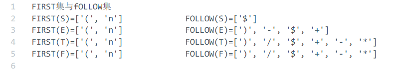
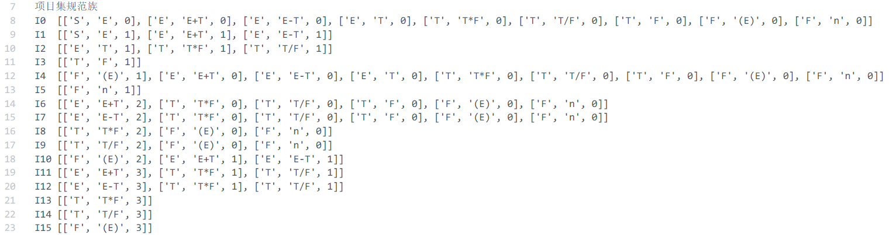
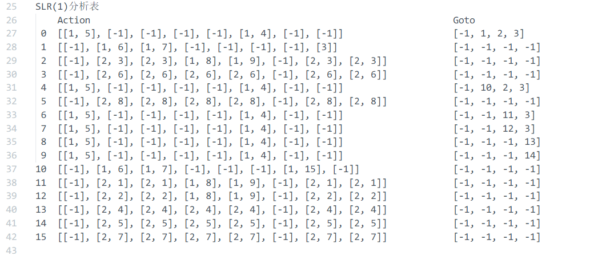
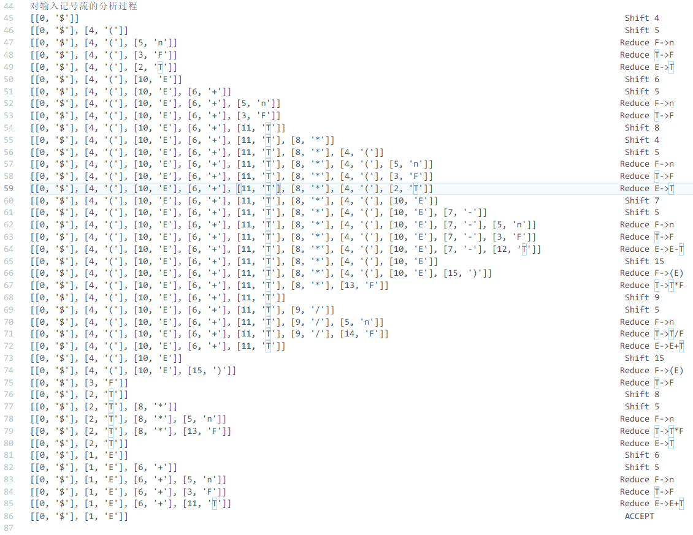

# Syntax Analyzer Exercise Report    

## Result    

Implement a basic syntax analyzer with Python, features including: 

1. Generate **FIRST SET** and **FOLLOW SET** of non-terminal symbols    
  

2. Generate **Canonical Collection** of LR(0) items    
     

3. Generate **SLR Analyzing Table**  
    
  
  >  `-1` represents `ERROR` status  

4. Generate analyze proecss    
   

Run `python3 Syntax.py` to see the above results. Only the 4th step is shown in the console, other steps' outputs are stored in the `Syntax Result.txt`.   

## Project Structure    

### Text Files    

`Syntax Result.txt` stores the output.  

`Syntatic Analyzer Test File.txt` is the test file for syntax analyzer.   

### Automation.py  

`Automation.py`
Methods to be used in the analyze progress.  
- `cal_first(), cal_follow(), cal_first_follow()` 　
- `generate_collections(), partition(), calculate_closure()`  
- `generate_table(), fill_table()`  

### Syntax.py  

The analyze process, calling methods in Automation.  

- `analyze()`  
- `process(), make_action()`  
